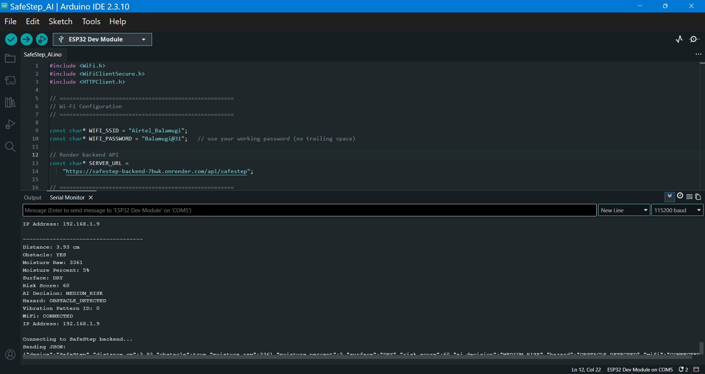

---

## 📟 Prototype Output

The SafeStep prototype provides real-time sensor and hazard information through the Arduino IDE Serial Monitor.

The Serial Monitor displays the distance measured by the ultrasonic sensor, obstacle detection status, moisture sensor reading, surface condition, calculated risk score, hazard classification, vibration pattern, and Wi-Fi connection status.

The output also shows the communication between the ESP32 and the SafeStep backend through HTTP.

### Serial Monitor Output



The example output demonstrates a live prototype reading where an obstacle is detected at a short distance while the moisture reading indicates a dry surface. The ESP32 processes these sensor readings, determines the current hazard condition, activates the corresponding alert logic, and sends the sensor data to the backend.

Example output information includes:

```text
Distance: 3.93 cm
Obstacle: YES
Moisture Raw: 3361
Moisture Percent: 5%
Surface: DRY
Risk Score: 60
AI Decision: MEDIUM_RISK
Hazard: OBSTACLE_DETECTED
Vibration Pattern ID: 0
WiFi: CONNECTED
